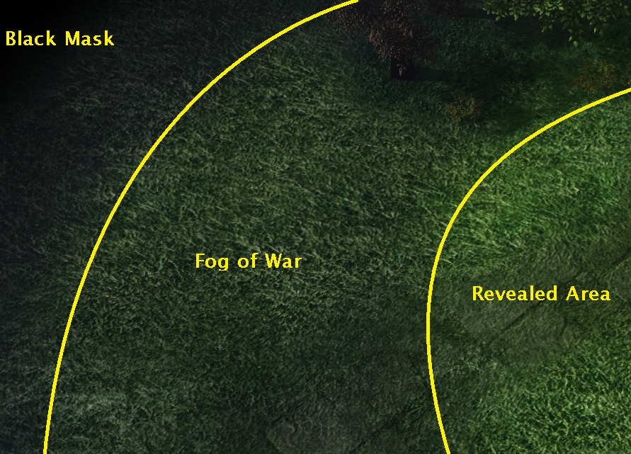
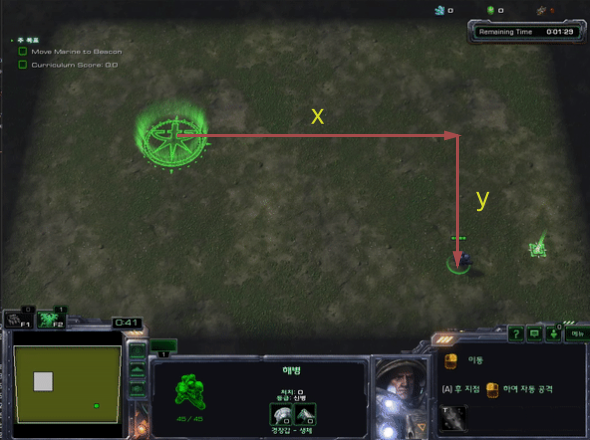
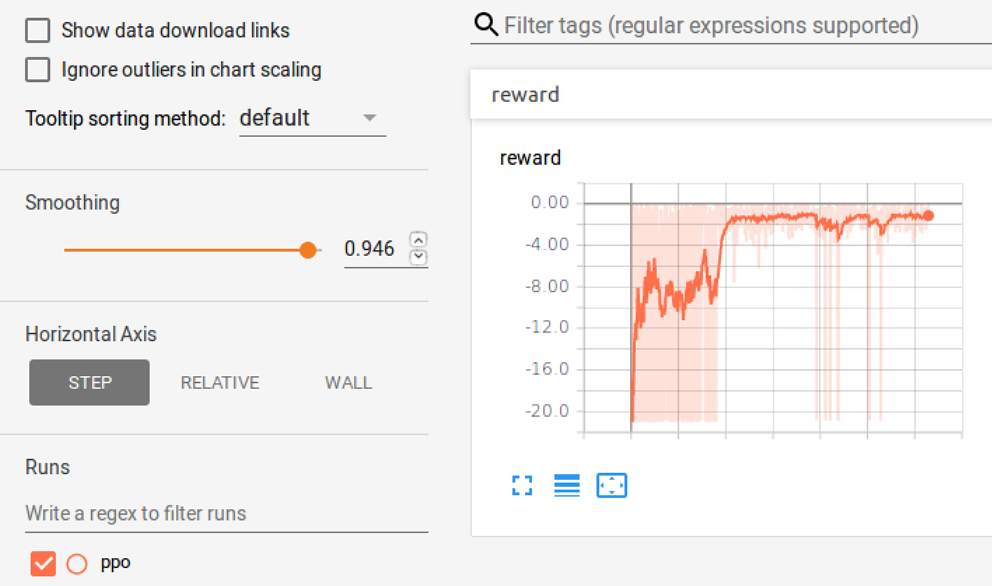

# 4WayBeacon Script Review

이 파일은 앞에서 정의한 Policy\_net.py와 ppo.py를 이용하여 실제 학습을 수행하는 파일입니다. 전체 코드는 [다음](https://github.com/sc2-korean-level/MoveToBeacon/blob/master/4wayBeacon_ppo/ex.py)을 참조하시면 됩니다.

```python
import sys
from absl import flags
from pysc2.env import sc2_env, environment
from pysc2.lib import actions, features
import matplotlib.pyplot as plt
import random
import tensorflow as tf
import numpy as np
from policy_net import Policy_net
from ppo import PPOTrain
import time
```

기본적으로 스타크래프트2\(pysc2\)에서 필요한 라이브러리들과 이전에 만든 Policy\_net.py와 ppo.py를 import합니다.

```python
_SELECT_ARMY = actions.FUNCTIONS.select_army.id
_MOVE_SCREEN = actions.FUNCTIONS.Move_screen.id
_NO_OP       = actions.FUNCTIONS.no_op.id
_NOT_QUEUED  = [0]
_QUEUED = [1]
_SELECT_ALL  = [0]
```

그리고 pysc2에서 제공하는 여러가지 변수들을 이용해 본 코드에서 사용할 몇가지 변수들을 정의합니다. \_SELECT\_ARMY는 유닛을 선택하라는 변수입니다. \_MOVE\_SCREEN은 미니맵이 아닌 스크린에서 특정 위치로 이동하라는 변수입니다. \_NO\_OP는 아무 행동도 하지 않는 변수입니다. \_NOT\_QUEUED와 \_QUEUED는 실제 스타크래프트2를 해보신 분은 바로 이해하실 수 있습니다. 실제 스타크래프트2를 플레이할 때 Shift를 이용하여 현재 수행하고 있는 행동 뒤에 수행할 행동을 예약할 수 있습니다. \_NOT\_QUEUED는 명령을 예약하지 말고 바로 수행하라는 뜻이며 \_QUEUED는 명령을 예약하라는 뜻입니다. \_SELECT\_ALL의 경우 \_SELECT\_ARMY와 결합하여 스크린에 있는 모든 유닛을 뜻합니다.

```python
env = sc2_env.SC2Env(map_name='MoveToBeacon',
                    agent_interface_format=sc2_env.parse_agent_interface_format(
                        feature_screen=16,
                        feature_minimap=16,
                        rgb_screen=None,
                        rgb_minimap=None,
                        action_space=None,
                        use_feature_units=False),
                    step_mul=4,
                    game_steps_per_episode=None,
                    disable_fog=False,
                    visualize=True)
```

이 코드는 실제 환경을 정의하는 부분입니다. map\_name은 구동할 맵의 이름입니다. 이 코드는 MoveToBeacon이라는 맵에서 강화학습을 수행하기에 'MoveToBeacon'으로 지정하였습니다. 이는 맵 파일 명과 같아야 합니다. 세세한 옵션들은 agent\_interface\_format내에서 정의됩니다. feature\_screen은 스크린의 이미지 가로 세로 크기를 정의합니다. feature\_minimap도 같습니다. pysc2 버전에서는 rgb\_screen과 rgb\_minimap에는 접근을 할 수 없습니다. step\_mul은 한번의 step에서 실제 스타크래프트2를 몇 프레임 구동시킬지를 뜻합니다. 예를 들면 특정 위치로 마린을 이동시킬 경우 step\_mul이 작을 수록 한 스텝당 마린의 이동거리가 짧으며 클수록 이동거리가 길어집니다. game\_step\_per\_episode의 경우 특정 변수 명 그대로 한 에피소드가 끝나는데까지 걸리는 step을 지정합니다. disable\_fog는 스타크래프트2내에 fog라는 영역을 보여줄지를 지정하는 변수입니다. fog는 현재 시야내 영역은 아니지만 이전에 시야내 영역에 들어왔었던 영역을 뜻합니다. fog가 무엇인지는 다음의 그림을 보시면 됩니다.



```python
with tf.Session() as sess:
        Policy = Policy_net('policy')
        Old_Policy = Policy_net('old_policy')
        PPO = PPOTrain(Policy, Old_Policy, gamma = 0.95)
        #sess.run(tf.global_variables_initializer())
        saver = tf.train.Saver()
        #saver.restore(sess, "4wayBeacon_ppo/tmp/model.ckpt")
```

ex.py 코드를 실행할 때 전체에 사용되는 $$tensorflow$$ 의 세션을 지정합니다. Policy\_net클래스의 객체를 각각 Policy와 Old\_Policy로 지정한 후 main 네트워크와 target 네트워크로 사용됩니다. 파라미터들을 학습시키기 위한 PPOTrain클래스의 객체를 PPO로 정의합니다. tf.global\_variables\_initializer\(\)의 경우 학습 시작 파리미터를 초기화하기 위해 사용됩니다. saver의 변수를 tf.train.Saver\(\)로 정의한 후 saver.restore를 통해 이미 학습시킨 모델의 경로로부터 파라미터를 불러옵니다. tf.global\_variables\_initializer\(\)와 saver.restore\(\)의 경우는 학습을 처음부터 시작할지 혹은 이미 가지고 있는 모델을 불러와서 사용할지에 따라 사용자가 직접 주석처리하여 사용합니다.

```python
for episodes in range(1000000):
    observations = []
    actions_list = []
    v_preds = []
    rewards = []
    obs = env.reset()
    action = actions.FunctionCall(_SELECT_ARMY, [_SELECT_ALL])
    obs = env.step(actions=[action])
    done = False
    global_step = 0    
    marine_y, marine_x = (obs[0].observation.feature_screen.base[5] == 1).nonzero()
    beacon_y, beacon_x = (obs[0].observation.feature_screen.base[5] == 3).nonzero()
    marine_x, marine_y, beacon_x, beacon_y = np.mean(marine_x), np.mean(marine_y), np.mean(beacon_x), np.mean(beacon_y)
    state = [marine_x*10/63 - beacon_x*10/63,  marine_y*10/63 - beacon_y*10/63]
```

몇 번의 에피소드를 실행할지를 정한 후 for루프로 에피소드를 계속 실행합니다.한번에 에피소드를 실행할 때 마다 어떠한 정보들이 사용되었는지를 저장하기 위해 observations, actions\_list, v\_preds, rewards라는 빈 리스트를 지정합니다.  
obs.reset\(\)을 통해 에피소드를 초기화 합니다. obs.reset\(\)을 수행하면 아무런 행동을 할 수 없습니다. 그 이유는 obs.reset\(\)을 실행하면 마린을 선택하기 전의 상태로 초기화합니다. 그렇기 때문에 마린을 옮기기 위해 먼저 마린을 선택해야합니다. \_SELECT\_ARMY와 \_SELECT\_ALL을 조합하여 스크린내에 존재하는 모든 유닛을 선택하라는 행동을 action으로 정의합니다.  
env.step\(actions=\[action\]\)을 통해 실제 게임에 모든 유닛을 선택하라는 행동을 수행합니다. env.step\(\)의 출력으로 받은 obs는 여러 변수들을 담고 있으며 현재 상태에 대한 많은 정보들을 품고 있습니다. 예를들어 reward, episode terminal, 그리고 가장 중요한 스크린에 대한 정보들이 있습니다.  
done은 사용자에 따라 다른 변수로 지정할 수 있지만 본 코드 내부에서는 에피소드의 끝\(True or False\)를 뜻합니다. 에피소드가 시작하자마자 끝나는 경우는 없으므로 강제적으로 False라고 정의합니다. global\_step의 경우 이번 에피소드에서 지난 스텝 수를 저장하기 위해 정의하였습니다.  
다음 현재 상태를 정의하기 위한 이미지의 전처리를 수행합니다.marine\_y에 마린의 y좌표를, marine\_x에 마린의 x좌표를, beacon\_y에 비콘의 y좌표를, beacon\_x에 x좌표를 저장합니다. 그 후 state에 비콘으로 부터 마린의 상대거리를 계산하여 저장합니다. 아래의 그림에서 \[x, y\]를 상태로 합니다.



```python
while not done:
    global_step += 1

    state = np.stack([state]).astype(dtype=np.float32)
    act, v_pred = Policy.act(obs=state, stochastic=True)
    act, v_pred = np.asscalar(act), np.asscalar(v_pred)

    if act == 0:
        dest_x, dest_y = marine_x + 3, marine_y
    if act == 1:
        dest_x, dest_y = marine_x, marine_y + 3
    if act == 2:
        dest_x, dest_y = marine_x - 3, marine_y
    if act == 3:
        dest_x, dest_y = marine_x, marine_y - 3
    actions_space = actions.FunctionCall(_MOVE_SCREEN, [_NOT_QUEUED, [np.clip(dest_x, 0, 15), np.clip(dest_y, 0, 15)]])
```

먼저 스텝이 지날때마다 global\_step을 하나씩 증가시키위해 global\_step += 1을 사용합니다.  
state를 Policy 네트워크에 넣어 action을 얻을 수 있는 형태로 가공한 후 Policy 네트워크의 입력으로 가집니다.그의 출력은 그 상태 일때의 action\(act\)와 Value-state\(v\_pred\)를 얻습니다. 이를 숫자인 Scalar 값으로 변환합니다.  
이번 프로젝트에서 네트워크가 할 수 있는 행동은 4가지이며 각각 상하좌우를 뜻합니다. 실질적 명령은 command와 pixel의 조합으로 이루어져 있습니다. 이번 강화학습에서의 command는 앞에서 변수로 지정한 \_MOVE\_SCREEN 하나밖에 없으며 pixel을 지정해 주어야 합니다. 코드에서 볼 수 있듯이 act에 따라 현재 마린의 위치로 부터 3픽셀만큼 오른쪽, 위, 왼쪽, 아래 위치를 지정한 후 command와 pixel의 값을 조합하여 실질적 명령인 actions\_space에 지정합니다.  
pixel 값을 0에서 15사이로 clip한 이유는 다음과 같습니다. 앞에서 feature\_screen에 의해 screen이 16 x 16의 크기를 갖도록 지정했습니다. screen 밖의 픽셀 값을 지정하여 실질적 명령을 만들 경우 버그가 발생하기 때문에 다음과 같이 0과 15사이의 값으로 clip합니다.

```python
obs = env.step(actions=[actions_space])
reward = -0.1
marine_y, marine_x = (obs[0].observation.feature_screen.base[5] == 1).nonzero()
beacon_y, beacon_x = (obs[0].observation.feature_screen.base[5] == 3).nonzero()
marine_x, marine_y, beacon_x, beacon_y = np.mean(marine_x), np.mean(marine_y), np.mean(beacon_x), np.mean(beacon_y)
distance = (marine_x*10/63 - beacon_x*10/63)**2 + (marine_y*10/63 - beacon_y*10/63)**2
next_state = [marine_x*10/63 - beacon_x*10/63,  marine_y*10/63 - beacon_y*10/63]

if global_step == 200 or distance < 0.3: done = True
if global_step == 200: reward = -1
if distance < 0.3: reward = 0

observations.append(state)
actions_list.append(act)
v_preds.append(v_pred)
rewards.append(reward)
```

위에서 정의한 action\_space를 env.step\(action=\[actions\_space\]\)를 통해 환경에 넣어줍니다. reward의 경우 한 스텝이 지날 때 마다 -0.1을 지정합니다. 빠른 시간내에 비콘에 도달하기 위한 reward 설계입니다. 그 후 앞에서 했었던 프로세스 대로 next\_state에 action\_space의 결과 상태를 저장합니다. 4WayBeacon의 경우 실제 비콘의 일정거리 안으로 도달하거나 일정 스텝이 지나도록 비콘의 일정거리안으로 도달하지 못하면 에피소드를 정지하도록 설정하였습니다. 마린과 비콘 사이의 거리를 계산한 후 distance에 정의합니다.  
이 두 가지를 하나만이라도 만족하면 에피소드를 정지하여야 하므로 done=True로 지정합니다. 그리고 마지막 스텝에 에피소드가 종료하였을 때 목표를 성공하였을 때와 성공하지 못했을때로 나누어 reward를 각각 0과 -1로 설계하여 정의합니다.  
마지막으로 학습을 하기 위해 앞에서 정의한 빈 리스트에 state, act, v\_pred, reward를 모두 쌓습니다.

```python
if done:
    v_preds_next = v_preds[1:] + [0]
    gaes = PPO.get_gaes(rewards, v_preds, v_preds_next)
    observations = np.reshape(observations, [-1, 2])
    actions_list = np.array(actions_list).astype(dtype=np.int32)
    rewards = np.array(rewards).astype(dtype=np.float32)
    v_preds_next = np.array(v_preds_next).astype(dtype=np.float32)
    gaes = np.array(gaes).astype(dtype=np.float32)
```

쌓은 변수들은 학습을 하기 위해 정제하는 부분입니다. v\_preds\($V\(s\_t\)$\)를 이용해 v\_preds\_next\($V\(s\_{t+1}\)$\)을 구하는 부분입니다. 예를들어 v\_preds가 \[1,2,3,4\]와 같은 모양을 가진다면 v\_preds\_next는 \[2, 3, 4, 0\]과 같은 모양을 가지도록 합니다.  
Proximal Policy Optimization에서는 쌓은 reward를 감가율이 적용된 Discounted Reward를 그대로 사용하는 것이 아니라 General Advantage Estimation을 통해 한 번 더 가공하여 사용합니다. gaes는 이를 뜻합니다.

```python
PPO.assign_policy_parameters()
    inp = [observations, actions_list, rewards, v_preds_next, gaes]
    for epoch in range(4):
        sample_indices = np.random.randint(low=0, high=observations.shape[0], size=64)  # indices are in [low, high)
        sampled_inp = [np.take(a=a, indices=sample_indices, axis=0) for a in inp]  # sample training data
        PPO.train(obs=sampled_inp[0],
                actions=sampled_inp[1],
                rewards=sampled_inp[2],
                v_preds_next=sampled_inp[3],
                gaes=sampled_inp[4])
```

앞에서 정제한 변수들을 이용하여 학습을 진행하는 부분입니다. 먼저 main 네트워크의 파라미터들을 target 네트워크로 덮어씌웁니다. 학습 후인 main 네트워크와 학습 전인 target 네트워크간의 파라미터 차이를 보이도록 하기 위함입니다. 앞에서 쌓은 변수들을 같은 순서를 가지도록 inp에 저장합니다.  
쌓은 변수들의 개수와 0사이의 숫자중 무작위로 64개를 선택한 후 sample\_indices로 정의합니다. sample\_indices를 통해서 sampled\_inp에 stochastic하게 학습을 진행합니다.  
이 학습을 통해 에피소드별 reward를 그래프화 하여 보면 다음과 같습니다.



그래프를 보면 최저 점수가 -20점이며 학습이 잘 진행된 경우에는 대략 -2점을 가지는 것을 볼 수 있습니다. 최저 점수가 -20점인 경우에는 에피소드가 끝날 때까지 비콘에 도달하지 못하는 것입니다. global\_step이 200에 도달할 경우 에피소드가 끝나고 각 스텝마다 -0.1점이기 때문에 도달하지 못할 경우 -20점이 되게 됩니다. 학습이 잘 진행이 된 경우에는 아무리 학습이 잘 되어도 평균적으로 -2점보다 좋은 점수를 얻지 못합니다. 그 이유는 환경이 초기화되면서 마린과 비콘의 위치가 무작위적으로 결정이 되기 떄문에 최소한으로 가야만 하는 스텝의 수가 존재하기 때문입니다.  
Proximal Policy Optimization 알고리즘을 이용해서 4방향으로 움직이는 마린을 비콘으로 빠른 시간에 도달하게 하도록 학습을 해보았습니다. 이를 확장시켜 생각하면 목적지에 도달하는 에이전트를 만드는 문제에 적용할 수 있을 것입니다.

