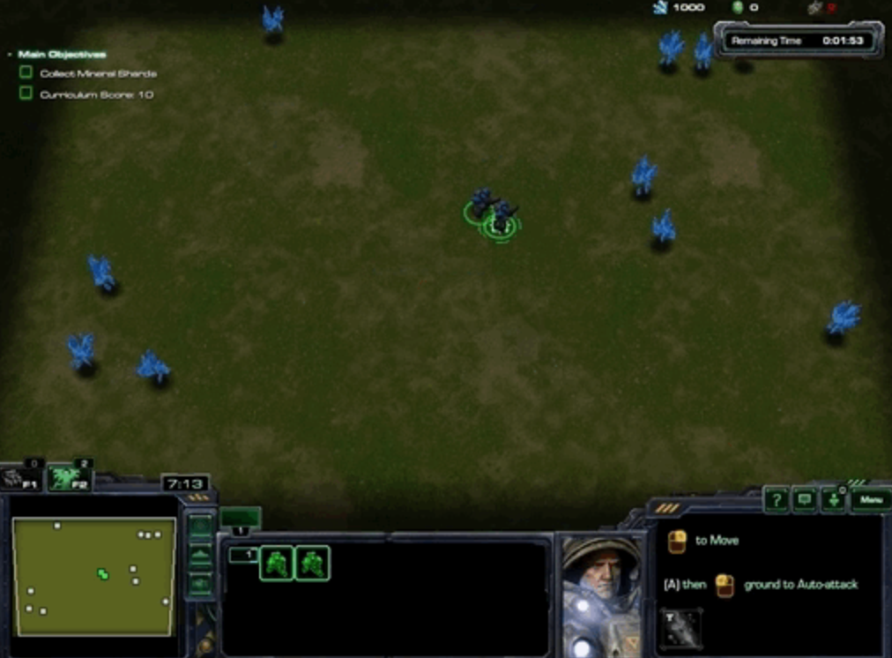
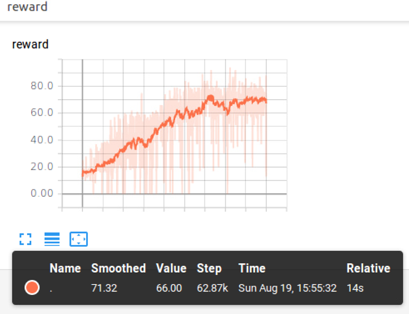

# CollectMineralShards Script Review

본 코드는 완전하게 [PositionBeacon Script Review](https://github.com/sc2-korean-level/MoveToBeacon/blob/master/PositionBeacon/ex.py) 의 코드와 같으며 다른 것은 환경을 정의할때 맵을 다르게 설정한 것 뿐입니다.

```python
env = sc2_env.SC2Env(map_name='CollectMineralShards',
                    agent_interface_format=sc2_env.parse_agent_interface_format(
                        feature_screen=16,
                        feature_minimap=16,
                        rgb_screen=None,
                        rgb_minimap=None,
                        action_space=None,
                        use_feature_units=False),
                    step_mul=4,
                    game_steps_per_episode=None,
                    disable_fog=False,
                    visualize=False)
```

위에서 설명하였듯이 바뀐점은 'CollectMineralShards'밖에 없습니다.

CollectMineralShards의 환경을 보면 다음 그림과 같습니다.



환경을 reset하면 위의 화면과 같이 미네랄이 화면에 무작위적으로 20개가 뿌려지고 2기의 마린 또한 무작위적으로 위치하게 됩니다. 에피소드 내에 20개의 미네랄을 다 획득한다면 또 다시 20개의 미네랄이 화면에 뿌려지며 에피소드가 끝날 때까지 이를 반복합니다.

본 코드에서도 환경에서 제공하는 reward\(obs\[0\].reward\)를 사용하며 하나의 미네랄을 획득하면 1 그외의 경우에는 0을 출력합니다. 에피소드의 끝을 나타내는 done\(obs\[0\].step\_type == environment.StepType.LAST\) 또한 환경에서 제공해주는 것을 사용하고 있으며 특정 시간이 되면 True 그 외에는 False를 출력합니다.

그 외의 코드 및 환경은 PositionBeacon과 완전히 같으며 CollectMineralShards에 대한 결과는 다음 그림과 같습니다.



약 63,000에피소드 이후부터 reward가 포화상태에 다다르는 것을 확인할 수 있으며 약 70점에서 reward가 정체되는 것을 볼 수 있습니다. 이는 한 에피소드에서 약 70개의 미네랄을 획득한다는 뜻입니다.

