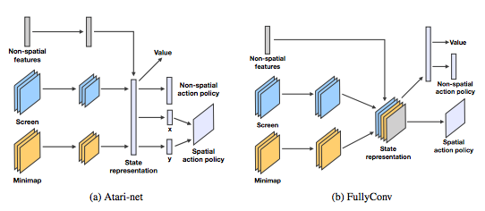
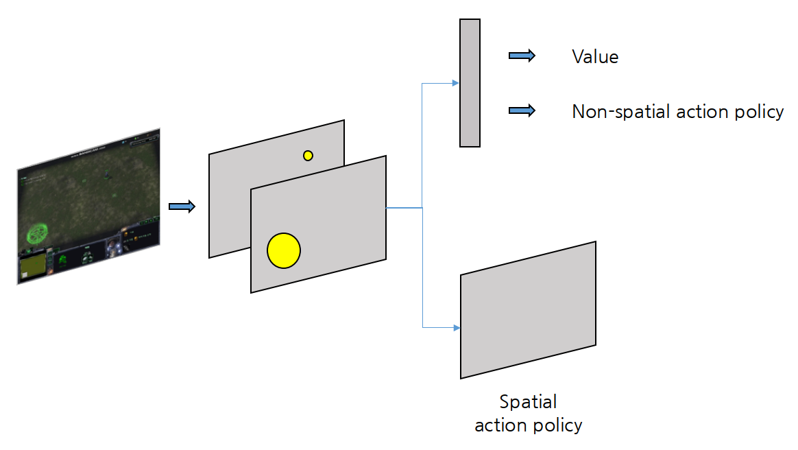

# PositionBeacon PPO Code Review

## Policy\_net.py

전체 코드는 [다음](https://github.com/sc2-korean-level/MoveToBeacon/blob/master/PositionBeacon/policy_net.py)을 참고하세요

이 파일은 4WayBeacon\_ppo 디렉토리에 있는 Policy\_net.py와 같은 구조를 가지고 있으나 네트워크의 구성 부분이 다르기에 이 부분만 언급합니다.

먼저 이 코드에 대해 설명하기 전에 Deepmind에서 낸 [첫 번째 스타크래프트2 관련 논문](https://arxiv.org/abs/1708.04782)에서 사용한 네트워크 구조 설명을 하겠습니다. 딥마인드에서 사용한 네트워크 구조에는 Atari-net, FullyConv, FullyConvLSTM으로 3가지가 있습니다. Atari-net과 FullyConv의 구조는 다음의 그림과 같습니다.



Atari-net과 FullyConv의 차이점은 Minimap과 Screen을 합치기 전 Fully-Connected Layer를 거치느냐에 있습니다. 본 책에서는 Fully-Conv 네트워크 구조를 가지며 MoveToBeacon의 경우 Non-spatial features\(미네랄, 가스, 인구 등등\)에 대한 정보가 필요없으며 Screen과 Minimap의 특성이 갖으므로 다음과 같이 네트워크의 구조를 수정하였습니다.



화면을 이미지로 받아서 마린의 위치와 비콘의 위치를 각각 나타내는 이미지를 하나씩 전처리하여 쌓습니다. 그 후 여러개의 Convolutional Neural Network를 거쳐 Value, Non-spatial action policy, Spatial action policy를 출력합니다.  
이러한 과정에 맞춰 PositionBeacon 내에 있는 Policy\_net 클래스의 \_\_init\_\_은 다음과 같이 수정이 됩니다.

```python
def __init__(self, name: str, temp=0.1):

    with tf.variable_scope(name):
        self.obs = tf.placeholder(dtype=tf.float32, shape=[None, 16*16*2], name='obs')
        reshape = tf.reshape(self.obs, [-1, 16, 16, 2])
        layer_1 = tf.layers.conv2d(inputs=reshape, filters=16, kernel_size=[5, 5], strides=[1, 1], padding='SAME', activation=tf.nn.relu)
        layer_2 = tf.layers.conv2d(inputs=layer_1, filters=32, kernel_size=[3, 3], strides=[1, 1], padding='SAME', activation=tf.nn.relu)
        layer_2 = tf.layers.conv2d(inputs=layer_1, filters=64, kernel_size=[3, 3], strides=[1, 1], padding='SAME', activation=tf.nn.relu)
        layer_2 = tf.layers.conv2d(inputs=layer_1, filters=128, kernel_size=[3, 3], strides=[1, 1], padding='SAME', activation=tf.nn.relu)
        with tf.variable_scope('policy_net'):
            reshape_spatial = tf.reshape(layer_2, [-1, 16*16*128])
            dense_1 = tf.layers.dense(inputs=reshape_spatial, units=256, activation=tf.nn.relu)
            self.act_probs = tf.layers.dense(inputs=dense_1, units=3, activation=tf.nn.softmax)
            self.spatial_probs = tf.layers.dense(inputs=dense_1, units=16*16, activation=tf.nn.softmax)
        with tf.variable_scope('value_net'):
            dense_2 = tf.layers.dense(inputs=dense_1, units=64, activation=tf.nn.relu)
            self.v_preds = tf.layers.dense(inputs=dense_2, units=1, activation=None, trainable=True, kernel_initializer=tf.contrib.layers.xavier_initializer())
        self.scope = tf.get_variable_scope().name
```

전처리한 이미지를 이미지의 형태를 가지도록 input을 넣어주지 않고 1행을 가지는 list로 만들어서 입력을 가집니다. 그 후 tf.reshape를 통해 원하는 이미지의 형태로 재변환합니다. 그 후 layer\_2를 통해 128개의 kernel를 가지도록 Convolutional Neural Network에 통과시킵니다. 마지막으로 원하는 action\_space에 맞게 self.action\_probs를 출력합니다. 여기서 self.action\_probs는 위 그림에서의 Non-spatial aciton policy입니다.self.spatial\_probs는 위 그림에서의 Spatial action policy입니다. 이미지의 픽셀에 대한 정보를 얻어야 하기에 이미지의 사이즈 만큼\(16x16\) softmax로 출력합니다. 또한 위 그림에서의 Value에 해당하는 self.v\_preds를 출력합니다.

```python
def act(self, obs):
    return tf.get_default_session().run([self.act_probs, self.spatial_probs, self.v_preds], feed_dict={self.obs: [obs]})
```

이 함수의 경우는 \_\_init\_\_함수에서 정의한 self.act, self.spatial\_probs, self.v\_preds의 값들을 obs\(상태\)에 대해 구하는 함수입니다.

이상 이 다음으로는 4WayBeacon에서와 같은 코드이므로 생략하겠습니다.

## ppo.py

전체 코드는 [다음](https://github.com/sc2-korean-level/MoveToBeacon/blob/master/PositionBeacon/ppo.py)을 참고하세요

먼저 이 코드에 대해 설명하기 전에 [첫 번째 스타크래프트2 관련 논문](https://arxiv.org/abs/1708.04782) 에서의 학습 방법을 설명하겠습니다. 앞에서 언급한 논문에서 전체 파라미터를 업데이트하는 방법은 일반적인 PPO와 같습니다. 하지만 일반적인 행동\(상, 하, 좌, 우를 고르는 것과 같은\)을 선택하는 방식과 달리 두 가지의 action policy\(Non-spatial action policy, Spatial action policy\)가 네트워크에서 출력되며 이를 합쳐서 한꺼번에 업데이트하는 방법을 취하고 있습니다. 수식으로 표현하자면 아래와 같습니다.

$$
maximize_\theta\;(G_t-v_\theta(s_t))\bigtriangledown_\theta log\pi_\theta(a_t|s_t)+\beta(G_t-v_\theta(s_t))\bigtriangledown_\theta v_\theta(s_t) \\ +\eta \Sigma_a\pi_\theta(a|s)log\pi_\theta(a|s)
$$

위의 식과 PPO에서 표현하고 있는 것이 다른 점은 $$G_t - v_\theta(s_t)$$ 입니다. 하지만 PPO에서 advantage\( $$\hat{A}_t$$ \)는 실제로 다음 상태의 가치\( $$R^a_s=G_t$$ \)와 현재 상태의 가치\( $$v_\theta(s_t)$$ \)의 차이를 뜻하는 것이므로 표현법만 다를 뿐이지 실제로 의미는 같습니다.

중요한 것은 두가지의 action policy를 하나로 합치는 방법입니다. 논문에서 볼 수 있듯이 하나로 합쳐진 action policy는 아래와 같이 정의됩니다.

$$
\pi(a|s) = \Pi\pi(a^l|a^{<l},s)=\pi(a^1|s)\pi(a^2|s)\cdots\pi(a^l|s)
$$

본 코드에서는 action policy는 두 가지를 하나로 합치게 되며 다음과 같이 표현될 수 있습니다.

$$
\pi(a|s) = \pi(a^1|s)\pi(a^2|s)
$$

그리고 더 구체적으로 설명하자면 $$\pi(a^1|s)$$ 는 policy\_net.py에서의 self.act\_probs이며 $$\pi(a^2|s)$$ 는 policy\_net.py에서 self.spatial\_probs를 뜻합니다.

이제 실제 코드를 설명하겠습니다. 대부분은 4WayBeacon PPO에 있는 ppo.py와 같으나 다른점만 설명하도록 하겠습니다.


```python
act_probs = self.Policy.act_probs
spatial_probs = self.Policy.spatial_probs
act_probs_old = self.Old_Policy.act_probs
spatial_probs_old = self.Old_Policy.spatial_probs
```

act\_probs와 spatial\_probs는 main 네트워크에서 상태에 대한 출력 값이므로 각각 $$\pi(a^1|s), \pi(a^2|s)$$ 의 전체 확를 뜻합니다.  마찬가지로 act\_probs\_old와 spatial\_probs\_old는 target 네트워크에서 상태에 대한 출력 값이므로 전 $$\pi_{\theta old}(a^1|s), \pi_{\theta old}(a^2|s)$$ 을 뜻합니다.  예를 들면 act\_probs는 \[0.2, 0.5, 0.3\]을, spatial\_probs\_old는 \[0.1 0.003 0.05 ..... 0.003\]을 뜻합니다. 하지만 우리가 학습해야 하는 수치들은 실제로 선택한 행동에 대한 값을 이용하여야 하므로 이를 실제 행동에 대한 수치만 추출하는 과정을 거쳐야 합니다.

