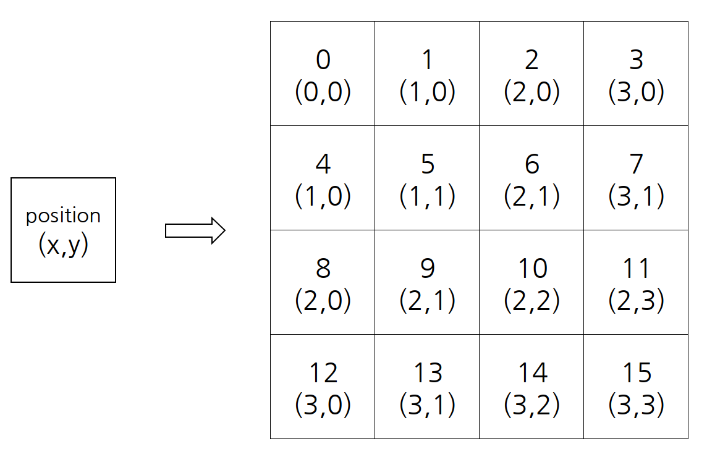
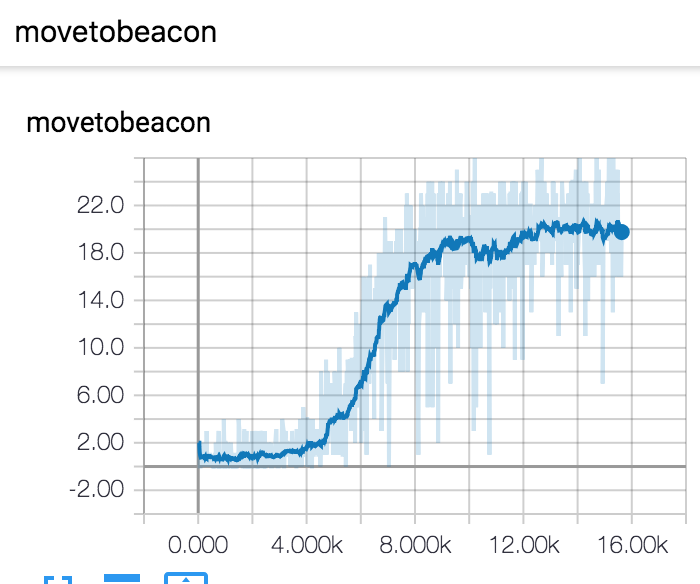

# PositionBeacon Script Review

전체 코드는 [다음](https://github.com/sc2-korean-level/MoveToBeacon/blob/master/PositionBeacon/ex.py)을 참고하세요

이번 코드는 대부분 4WayBeacon Script Review와 대부분 같은 코드를 사용하고 있으며 몇가지 다른 점에 대해서만 설명을 하겠습니다.

```python
marine_map = (obs[0].observation.feature_screen.base[5] == 1)
beacon_map = (obs[0].observation.feature_screen.base[5] == 3)
state = np.dstack([marine_map, beacon_map]).reshape(16*16*2).astype(int)
```

4WayBeacon의 경우 마린의 위치와 비콘의 위치를 받아 둘의 상대좌표를 구하는 작업을 진행하는데 본 코드에서는 이미지를 그대로 받기 때문에 추가적인 전처리를 진행하지 않습니다. 단지 한 에피소드에서 거쳐간 상태들을 저장하기 쉬운 상태\(1행만 가지는 행렬\)로 변환합니다. Policy\_net.py에서 다시 reshape를 통해 이미지의 형태로 변환하기 때문에 1행만 가지는 행렬의 형태로 변환되었지만 실제 학습은 이미지의 형태로 진행합니다.

```python
action_policy, spatial_policy, v_pred = Policy.act(obs=state)
#if global_step == 1: print(action_policy, spatial_policy, v_pred)
action_policy, spatial_policy = np.clip(action_policy, 1e-10, 1.0), np.clip(spatial_policy, 1e-10, 1.0)
#print(action_policy, spatial_policy, v_pred)
```

현재 상태에 대한 non-spatial action policy\(action\_policy\), spatial action policy\(spatial\_action\_policy\), state-value\(v\_preds\)를 구합니다. 두 action policy의 경우 0이 되면 안되기 때문에\(학습을 진행할 때 값들이 log를 통과하기 때문에 발산의 여지가 있음\) 0에서 1사의 값들을 매우 작은 수\(1e-10\)에서 1사이의 값으로 clip합니다.

```python
available_action = obs[0].observation.available_actions
y, z, k = np.zeros(3), np.zeros(3), 0
if 331 in available_action: y[0] = 1        # move screen
if 7 in available_action: y[1] = 1          # select army
if 0 in available_action: y[2] = 1          # no_op
for i, j in zip(y, action_policy[0]):       # masking action
    z[k] = i*j
    k += 1
```

위의 코드는 스타크래프트2 환경에서 non-spatial action policy를 사용할 때 가장 중요한 부분입니다. 논문에서는 이 작업을 action masking이라고 표현합니다. action masking은 현재 선택할 수 있는 action 내에서만 action을 선택하는 것을 뜻합니다. 예를 들어 마린을 선택하기 전의 상태에서는 move\_screen이라는 행동을 선택할 수가 없기에 그 외의 행동 중에서 선택합니다. 수치적으로 표현을 하자면 현재 선택할 수 있는 action이 0\(아무 행동을 하지 않음\), 7\(마린을 선택함\) 둘 뿐이라고 가정하고 네트워크가 출력한 non-spatial action policy의 수치가 \[0.2 0.5 0.3\]일 경우 z는 \[0 0.5 0.3\]으로 정의됩니다. 

```python
action = np.random.choice(3, p=z/sum(z))           # sampling action
position = np.random.choice(16*16, p=spatial_policy[0])
x, y = int(position % 16), int(position//16)    # get x, y
if action == 0: actions_ = actions.FunctionCall(_MOVE_SCREEN, [_NOT_QUEUED, [x, y]])
if action == 1: actions_ = actions.FunctionCall(actions.FUNCTIONS.select_army.id, [_SELECT_ALL])
if action == 2: actions_ = actions.FunctionCall(actions.FUNCTIONS.no_op.id, [])
```

다음 확률에 기반하여 선택하기 위해서는 np.random.choice의 argument인 p에는 확률을 뜻하는 행렬이 들어가게 되는데 행렬의 각 인덱스 값들의 합이 1이 되어야합니다. 그렇기 때문에 z/sum\(z\)를 이용하여 정규화한 후 p로 정의합니다. 그리고 본 코드에서는 3가지의 non-spatial action policy\(행동 안함, 마린을 선택함, 이동함\)가 존재하기 때문에 np.random.choice를 통해 실제 행동할 것을 선택합니다.

다음 position의 경우는 실제 이미지의 포인트 중 한 점을 뜻합니다. spatial\_policy\[0\]는 네트워크의 출력 중 spatial action policy를 뜻하며 1x\(image의 가로\)x\(image의 세로\)의 형태를 띄고 있습니다. 본 코드에서는 16x16의 이미지를 사용하기에 1x256의 크기를 가지는 행렬로 이루어져 있습니다. spatial action policy는 각각 점을 선택할 확률을 뜻하는 값들로 이루어져 있으며 그 확률에 기반하여 한 점을 선택하고 그 값을 position으로 정의합니다. x, y는 position의 값을 이미지에서 가로 세로에 맞게 변환합니다. 예를 들어 position의 값이 182라면 x는  6, y는 11을 뜻합니다. 아래의 그림을 참조하면 더 쉽게 이해할 수 있습니다. 아래의 그림은 4x4의 이미지에 대한 예시입니다.



```python
if action == 0: actions_ = actions.FunctionCall(_MOVE_SCREEN, [_NOT_QUEUED, [x, y]])
if action == 1: actions_ = actions.FunctionCall(actions.FUNCTIONS.select_army.id, [_SELECT_ALL])
if action == 2: actions_ = actions.FunctionCall(actions.FUNCTIONS.no_op.id, [])
```

이전에 얻은 action에 의해서 세 가지 종류의 실제 pysc2의 env.step\(\)에 들어가는 action\_를 정의합니다. action이 0일 경우 특정 지점으로 움직여라, 1일 경우 마린을 선택하라 그리고 2일 경우 아무 행동도 하지 말아라를 뜻합니다.

```python
obs = env.step(actions=[actions_])
marine_map = (obs[0].observation.feature_screen.base[5] == 1)
beacon_map = (obs[0].observation.feature_screen.base[5] == 3)
next_state = np.dstack([marine_map, beacon_map]).reshape(16*16*2).astype(int)
reward = obs[0].reward
done = obs[0].step_type == environment.StepType.LAST
observations.append(state)
actions_list.append(action)
v_preds.append(np.asscalar(v_pred))
spatial.append(position)
rewards.append(reward)
```

4WayBeacon PPO 와 달리 본 코드에서는 딥마인드에서 구현한 코드와의 성능 비교를 하기 위해 reward를 따로 지정하지 않고 환경에서 내어주는 값을 사용합니다\(reward = obs\[0\].reward\). 이 값은 계속 0을 출력하고 있으며 마린이 비콘에 도착하는 순간 1을 출력합니다. 그리고 에피소드가 끝났음을 알기 위한 파라미터인 done을 환경에서 제공하는 값을 사용합니다\(done = obs\[0\].step\_type==environment.StepType.LAST\). 이 값은 특정 시간에 다다르면 True를 출력하며 그 외의 값은 False를 뜻합니다.

위에서 선택한 non-spatial action policy, spatial action policy, state, State-Value, reward를 메모리에 저장합니다.

```python
if done:
    v_preds_next = v_preds[1:] + [0]
    gaes = PPO.get_gaes(rewards, v_preds, v_preds_next)
    observations = np.reshape(observations, [-1, 16*16*2])
    actions_list = np.array(actions_list).astype(dtype=np.int32)
    spatial = np.array(spatial).astype(dtype=np.int32)
    rewards = np.array(rewards).astype(dtype=np.float32)
    v_preds_next = np.array(v_preds_next).astype(dtype=np.float32)
    gaes = np.array(gaes).astype(dtype=np.float32)
                
    PPO.assign_policy_parameters()
    inp = [observations, actions_list, spatial, rewards, v_preds_next, gaes]
    for epoch in range(10):
        sample_indices = np.random.randint(low=0, high=observations.shape[0], size=64)  # indices are in [low, high)
        sampled_inp = [np.take(a=a, indices=sample_indices, axis=0) for a in inp]  # sample training data
        PPO.train(obs=sampled_inp[0],
            spatial=sampled_inp[2],
            actions=sampled_inp[1],
            rewards=sampled_inp[3],
            v_preds_next=sampled_inp[4],
            gaes=sampled_inp[5])
```

에피소드가 끝났을 경우 메모리에 저장된 모든 데이터들을 이용하지 않고 64개의 인덱스에 맞게 무작위하게 추출을 하여 학습을 하게 됩니다.

위의 코드를 통해 결과를 보면 다음과 같습니다.



약 10,000 에피소드를 지나면 reward의 포화상태에 다다르는 것을 볼 수 있으며 주어진 시간내에 20번 정도 비콘에 다다르는 것을 확인할 수 있습니다.

