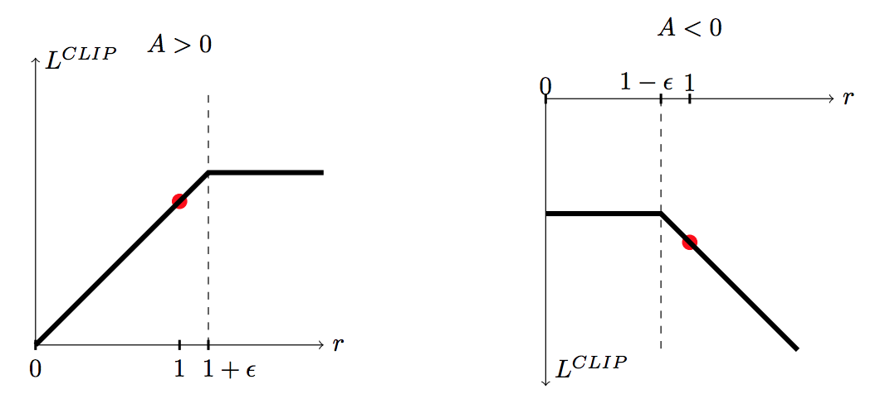

# Proximal Policy Optimization Review

## Proximal Policy Optimization

기본적으로 Reinforcement Learning의 Proximal Policy Optimization\(이하 PPO\)은 Trust Region Policy Optimization\(이하 TRPO\)을 실용적으로, 컴퓨터 친화적으로\(연산에 용이하도록\) 알고리즘을 수정한 것입니다. 또한 Actor와 Critic이라는 두 가지 네트워크를 이용하여 수행하는 알고리즘이며 이를 ㅇ최적으로 업데이트 하는 방법을 제안합니다.

일반적인 Reinforcement Learning의 목표는 대부분 목표함수인 Expected Reward를 최대화 할 수 있는 정책을 구성하는 파라미터\( $$\theta$$ \)를 찾는 것 입니다.

Reinforcement Learning에서의 목표함수 Expected Reward는 다음과 같이 표현됩니다.

$$
\eta(\pi) = \hat{E}_t[\Sigma log \pi_\theta(a_t|s_t)\hat{A}_t]
$$

위의 식에서 $$\pi_\theta$$ 는 stochastic policy이며 $$\hat{A}_t$$는 가치를 평가하는 네트워크에 의해 t의 시점에서 추정되는 Advantage입니다. 이 목표함수를 최대화 하기 위해 Reinforcement Learning에서는 파라미터\( $$\theta$$ \)에 대해서 Gradient를 사용하여 최대화하는 방향으로 업데이트합니다.

PPO는 TRPO에서 파생되어 나오는 알고리즘이기에 TRPO에 대해 먼저 간단히 알아보겠습니다. 자세히 알고 싶다면 [Trust Region Policy Optimization](https://arxiv.org/pdf/1502.05477.pdf) 을 직접 읽어보시는 것을 권합니다. TRPO에서는 목표함수인 surrogate objective\( $$\hat{E}_t[\dfrac{\pi_\theta(a_t|s_t)}{\pi_{\theta old}(a_t|s_t)}]$$ \)라는 것을 제안하며 안정적인 파라미터 업데이트를 위해 constraint를 이용합니다. constraint를 적용하기 위해 이전 스텝의 파라미터\( $$\theta_{old}$$ \)와 현재 스텝의 파라미터\( $$\theta$$ \)간의 차이를 이용하며 이 차이가 매우 클 경우 제한을 주어 신뢰구간\(Trust Region\)내에서의 업데이트를 수행합니다. TRPO에서는 이전 파라미터와 현재 파라미터의 차이를 KL-Divergence를 통해 구하며 최종적으로 아래의 식을 이용하여 파라미터를 업데이트합니다.

$$
maximize_\theta \hat{E}_t[\dfrac{\pi_\theta(a_t|s_t)}{\pi_{\theta old}(a_t|s_t)}\hat{A}_t] \\ subjected \; to \; \hat{E}_t[KL[\pi_{\theta old}(\cdot|s_t),\pi_\theta(\cdot|s_t)]]
$$

하지만 TRPO에서는 constraint optimization 문제를 해결하는데 Second-order KL-Divergence를 이용하거나 Conjugate Gradient를 사용하기 때문에 컴퓨터에게 많은 연산량을 요구합니다.

이 문제로 PPO에서는 surrogate function을 업데이트할 때 신뢰 구간을 강제적으로 알고리즘을 설계하는 사람이 아래의 식과 같 Clipping기법으로 설정함으로써 연산량을 줄이고 있습니다.

$$
maximize_\theta L^{CLIP}(\theta) = \hat{E}_t[min(r_t(\theta)\hat{A}_t), clip(r_t(\theta), 1-\epsilon, 1+\epsilon)\hat{A}_t]
$$

위의 식에서 $$r_t(\theta) = \dfrac{\pi_\theta(a_t|s_t)}{\pi_{\theta old}(a_t|s_t)}$$ 입니다. $$\epsilon$$ 은 하이퍼파라미터로 Continuous action일 때는 0.2, Discrete action일 때는 $$0.1 \times \alpha$$ 일 때가 가장 성능이 좋으며 $$\alpha$$ 는 학습률로 1에서 시작하여 점점 0으로 수렴합니다.

아래의 그림을 통해서 clip의 효과를 설명하겠습니다.

왼쪽의 그림은 위의 Advantage가 양수일 때 $$r_t(\theta)$$ 의 변화에 따라서 $$L^{CLIP}$$ 의 변화를 나타낸 것입니다. Advantage가 양수라는 것은 가치가 현재보다 높다라는 것이며 파라미터를 양의 방향으로 업데이트해야 합니다. 상태 s에서 행동 a를 선택할 확률 $$\pi(a_t|s_t)$$ 가 증가하게 업데이트하며 $$r_t(\theta)$$ 가 아무리 커지더라도 $$\epsilon$$ 으로 Clipping함으로써 신뢰구간 내에서 파라미터를 업데이트 합니다.

오른쪽 그림은 Advantage가 음수일때 $$r_t(\theta)$$ 의 변화에 따라서 $$L^{CLIP}$$ 의 변화를 나타낸 것입니다. 왼쪽의 그림과 반대로 Advantage가 음수라는 것은 현재보다 가치가 낮다라는 것이며 상태 s에서 행동 a를 선택할 확률 $$\pi(a_t|s_t)$$ 을 떨어뜨리는 방향으로 Clipping 기법으로 신뢰구간 내에서 파라미터를 업데이트합니다.

## Update Algorithm

글의 초반부에서 설명하였듯이 PPO는 [Advantage Actor Critic](https://blog.openai.com/baselines-acktr-a2c/) 알고리즘 중 하나로 볼 수 있습니다. Advantage Actor Critic을 업데이트할 때와 같은 방법으로 업데이트 합니다. PPO에서는 Surrogate Function\( $$L^{CLIP})$$ 을 최대화하는 방향으로 그리고 많은 Policy Gradient기법에서 사용하고 있는 Exploration기법인 Action Entropy\( $$S[\pi_\theta]$$ \)를 최대화 하는 방향으로 Actor 네트워크를 업데이트하며 State-Value\( $$L^{VF}$$ \)의 차이를 최소화 하는 방향으로 Critic 네트워크를 업데이트합니다. 이를 다시 수ㄱ식으로 표현하면 다음과 같습니다.

$$
maximize\;L^{CLIP}(\theta) = \hat{E}_t[min(r_t(\theta)\hat{A}_t), clip(r_t(\theta), 1-\epsilon, 1+\epsilon)\hat{A}_t]
$$

$$
minimize\;L^{VF}(\theta)=R^s_a + \gamma V(s_{t+1}) - V(s_t)
$$

$$
maximize\;S[\pi_\theta] = -\Sigma \pi(a_t|s_t)log\pi(a_t|s_t)
$$

이를 하나씩 최적화 하는 기법을 기존의 Advantage Actor Critic에서 사용하고 있지만 PPO에서는 하나의 식으로 통합하여 한번에 최적화를 수행합니다.

$$
maximize\; L^{CLIP+VF+S}=\hat{E}_t[L_t^{CLIP}(\theta)-c_1L_t^{VF}(\theta)+c_2S[\pi_\theta(s_t)]]
$$

여기서 $$c_1$$ 과 $$c_2$$ 는 하이퍼파라미터이며 Value-State network 최적화 정도와 Exploration의 정도를 정의합니다.

[Proximal Policy Optimization](https://arxiv.org/pdf/1502.05477.pdf) 논문에서는 [A2C](https://arxiv.org/abs/1602.01783), [A2C with Trust Region](https://arxiv.org/abs/1611.01224), [CEM](http://iew3.technion.ac.il/CE/files/papers/Learning%20Tetris%20Using%20the%20Noisy%20Cross-Entropy%20Method.pdf), Vanilla PG with Adaptive, [TRPO](https://arxiv.org/abs/1502.05477)와 PPO를 비교분석하면서 알고리즘의 성능을 보여줍니다. TRPO에서 파생되어 나온 알고리즘에도 불구하고 오히려 TRPO의 성능을 뛰어 넘는 지표를 보여주며 현재 Policy Gradient를 사용하는 Reinforcement learning 알고리즘에서 SOTA를 기록하고 있으며 OpenAI, ML-Unity에서 Baseline으로 사용하고 있습니다.

